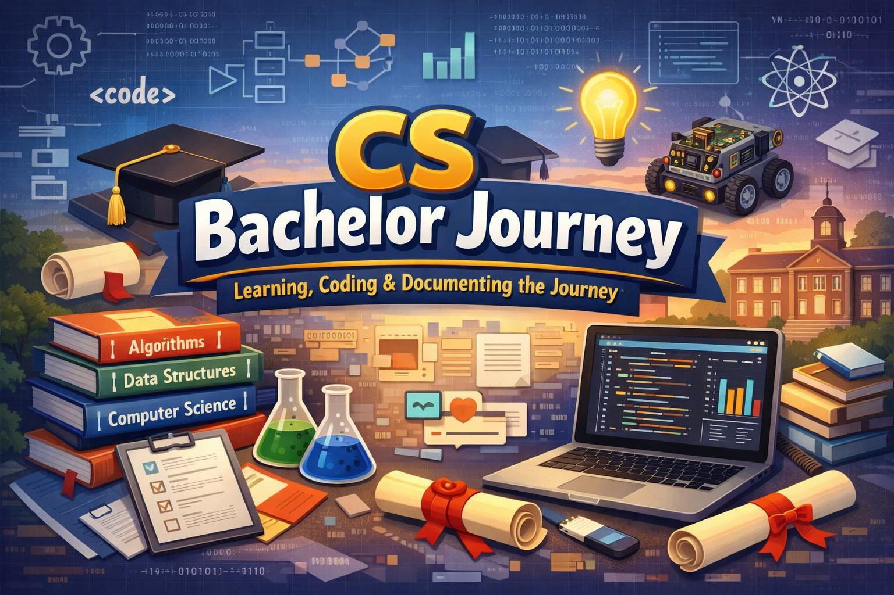

<h2>🎓 CS Bachelor Journey</h2>

This organization contains all repositories created during [@Lil-Code30](https://github.com/Lil-Code30)'s **Bachelor's degree in Computer Science**.

It serves as a structured archive of my academic work while studying computer science.

## 📚 Contents

Repositories in this organization may include:

- 📝 Assignments
- 🧪 Lab exercises
- 📊 School projects
- 💻 Programming practice
- 📖 Learning resources
- 📦 Course notes
- 🧠 Experiments and prototypes

## 🏫 Purpose

- Track my learning journey in computer science
- Organize academic work in a structured way
- Keep a history of projects and assignments
- Document the learning process
- Build a long-term academic knowledge base

> The goal is to keep a complete record of my progress as a computer science student.

## 📜 License

Repositories may have different licenses depending on the project and course requirements.

---

_⭐ Learning in public, documenting the journey._
